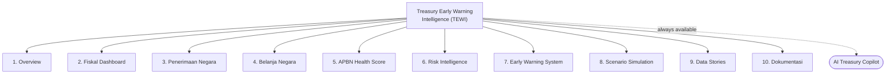
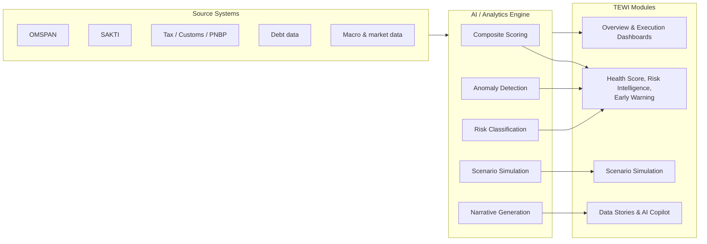

# Treasury Early Warning Intelligence (TEWI) — Product Requirements Document

**AI-Powered Fiscal Risk & APBN Monitoring System for DJPb**

---

## Document Control

| Field | Detail |
|---|---|
| Product name | Treasury Early Warning Intelligence (TEWI) |
| Owning organization | Direktorat Jenderal Perbendaharaan (DJPb), Kementerian Keuangan RI |
| Document status | Draft v1.0 |
| Prepared | 1 July 2026 |
| Source material | Two dashboard concept mockups — an Overview screen and a 9-module detail screen |

---

## About This Document

This PRD was reverse-engineered from two high-fidelity dashboard mockups rather than written from a pre-existing brief. Everything describing **what the interface shows and how it behaves** — KPI cards, charts, tables, thresholds, AI-generated content — is grounded directly in the mockups. Everything describing **why the product exists, who it's for, how success is measured, how it should be sequenced, and how it should be governed** is a reasonable product-management proposal, since mockups show a UI, not a business case.

Sections that are proposed rather than observed are marked **(Proposed)** and should be validated with DJPb stakeholders (Fiscal Policy Office, IT/Data, Compliance) before this PRD is finalized for build.

---

## Table of Contents

1. [Executive Summary](#1-executive-summary)
2. [Background & Problem Statement](#2-background--problem-statement)
3. [Goals & Success Metrics (Proposed)](#3-goals--success-metrics-proposed)
4. [Target Users & Personas (Proposed)](#4-target-users--personas-proposed)
5. [Scope](#5-scope)
6. [Information Architecture](#6-information-architecture)
7. [Functional Requirements](#7-functional-requirements)
8. [AI/ML Requirements & Governance](#8-aiml-requirements--governance)
9. [Data Requirements](#9-data-requirements)
10. [Non-Functional Requirements](#10-non-functional-requirements)
11. [Design & UX Guidelines](#11-design--ux-guidelines)
12. [Roles & Permissions (Proposed)](#12-roles--permissions-proposed)
13. [Release Plan (Proposed)](#13-release-plan-proposed)
14. [Risks & Assumptions](#14-risks--assumptions)
15. [Open Questions](#15-open-questions)
16. [Glossary](#16-glossary)
17. [Appendix](#17-appendix)

---

## 1. Executive Summary

Treasury Early Warning Intelligence (TEWI) is a web-based, AI-powered analytics platform that gives DJPb a single, real-time view of Indonesia's state budget (APBN) execution. It consolidates revenue, expenditure, financing, and cash-position data into one cockpit; scores overall fiscal health with an explainable composite index; flags spending anomalies and emerging macro-fiscal risks automatically; lets analysts simulate the budget impact of external shocks (oil prices, exchange rates, global growth); and turns all of the above into plain-language narratives an executive can read in under a minute.

The product's core bet: **fiscal risk compounds fastest when it's invisible.** By surfacing stress signals — energy subsidy pressure, tax revenue slowdown, regional vulnerability — earlier than a manual reporting cycle would, TEWI is designed to shift DJPb from retrospective reporting toward proactive fiscal risk management.

---

## 2. Background & Problem Statement

DJPb is responsible for monitoring execution of the APBN (Anggaran Pendapatan dan Belanja Negara) across thousands of *satker* (working units), *Kementerian/Lembaga* (K/L), and regional treasury offices (Kanwil DJPb, KPPN), drawing on transactional data from systems such as OMSPAN and SAKTI.

Organizations operating at this scale typically face a common set of problems that a design like this is built to solve:

- **Fragmented visibility.** Revenue, expenditure, financing, and cash data live in different systems and reports; assembling "how healthy is the budget right now" into one number takes manual effort.
- **Reactive risk detection.** Spending anomalies and emerging fiscal pressure (e.g., an energy subsidy overrun) are typically caught in periodic review cycles, not near real time.
- **Limited foresight.** Without a scenario tool, answering "what happens to the deficit if oil prices rise 20%" requires an ad hoc analytical exercise rather than an on-demand simulation.
- **High reporting overhead.** Producing the narrative context leadership needs ("why did the deficit widen this month") is manual and time-consuming.
- **External volatility.** Global commodity prices, exchange rates, and interest rates move faster than traditional reporting cycles, and Indonesia's fiscal position — particularly energy subsidy exposure — is materially sensitive to them.

TEWI is designed to close these gaps by combining DJPb's own execution data with AI-driven scoring, anomaly detection, simulation, and narrative generation in one continuously updated platform.

---

## 3. Goals & Success Metrics (Proposed)

### 3.1 Business Goals
- Shorten the time between a fiscal risk emerging and DJPb leadership becoming aware of it.
- Improve the accuracy and timeliness of in-year deficit, revenue, and cash forecasts.
- Increase the transparency and defensibility of APBN execution reporting, internally and to oversight bodies.
- Give policy teams an evidence base — including scenario results — for subsidy, spending, and financing decisions.

### 3.2 Product Goals
- Provide one authoritative, always-current view of APBN health.
- Automate anomaly and threshold monitoring that would otherwise require manual review of satker-level transactions.
- Make "what if" scenario analysis self-service instead of a special analytical request.
- Reduce the manual effort of producing narrative fiscal commentary.

### 3.3 Proposed Success Metrics

| Metric | What it tells us |
|---|---|
| Weekly/monthly active users by role and unit | Adoption across DJPb HQ, Kanwil, KPPN |
| Median time from data refresh to leadership review | Time-to-insight |
| Precision/recall of flagged spending anomalies (analyst-validated) | AI detection quality |
| MAPE of deficit/revenue forecasts vs. actuals | Forecasting value |
| % reduction in manual hours spent producing fiscal commentary | Reporting efficiency gain |
| % of Early Warning "Waspada/Kritis" indicators reviewed within SLA | Response speed |
| User satisfaction / NPS (analyst and leadership cohorts, separately) | Perceived value |

These should be baselined against current (pre-TEWI) manual processes and confirmed with stakeholders.

---

## 4. Target Users & Personas (Proposed)

| Persona | Primary needs | Primary modules |
|---|---|---|
| **Fiscal Risk Analyst** (DJPb HQ) | Daily monitoring, root-cause investigation, anomaly triage | Risk Intelligence, Early Warning System, Penerimaan/Belanja Negara, Scenario Simulation |
| **Treasury Leadership** (Direktur/Dirjen level) | Fast, defensible situational awareness; briefing talking points | Overview, APBN Health Score, Data Stories |
| **Regional Treasury Staff** (Kanwil DJPb / KPPN) | Own-region vulnerability and anomaly visibility | Overview (regional map), Belanja Negara, Early Warning System |
| **Ministry Leadership / cross-agency stakeholders** | High-level narrative suitable for policy communication | Overview, Data Stories, APBN Health Score |
| **Auditor / Compliance** (Itjen Kemenkeu, BPK liaison) | Methodology transparency, audit trail | Dokumentasi, Risk Intelligence |

Personas and their module priorities should be validated with DJPb; the mapping above follows from what each mockup screen emphasizes.

---

## 5. Scope

### 5.1 In Scope
The complete set of 10 modules and the AI Copilot shown across both mockups (see §6 Information Architecture and §7 Functional Requirements).

### 5.2 Explicitly Out of Scope (V1)
- **Budget formulation/drafting.** TEWI monitors *execution* of an already-approved APBN; it does not support the budget planning/drafting workflow.
- **Write-back to source systems.** TEWI is a read-only analytics and monitoring layer over OMSPAN, SAKTI, and other source systems; it does not post transactions back into them.
- **Public-facing transparency portal.** This PRD covers an internal DJPb tool; a public-facing version, if desired, is a separate product decision with different data-sensitivity and access rules.
- **Native mobile app.** Mockups show desktop web layouts only; mobile is addressed as an open question (§15).

### 5.3 Proposed Phasing
See §13 (Release Plan).

---

## 6. Information Architecture

TEWI is organized as a persistent left-hand navigation with 10 modules, a persistent top header, and a global AI assistant available from any screen.

| # | Module | One-line purpose |
|---|---|---|
| 1 | **Overview** | Executive snapshot: top KPIs, stress index, regional map, AI narrative |
| 2 | **Fiskal Dashboard** | Budget-execution view: realization vs. target/pagu |
| 3 | **Penerimaan Negara** | State revenue detail and drivers |
| 4 | **Belanja Negara** | State expenditure detail and drivers |
| 5 | **APBN Health Score** | Composite, explainable fiscal health score and trend |
| 6 | **Risk Intelligence** | Categorized, prioritized fiscal risk register |
| 7 | **Early Warning System** | Threshold-based indicator monitoring |
| 8 | **Scenario Simulation** | Interactive what-if shock modeling |
| 9 | **Data Stories** | Curated, AI-narrated fiscal storylines with recommendations |
| 10 | **Dokumentasi** | Methodology, definitions, policy, and user documentation |
| — | **AI Treasury Copilot** | Global conversational Q&A, available from every screen |

---

## 7. Functional Requirements

> Sample values below (e.g., "Rp1.158,7 T") are illustrative data shown in the mockups, not fixed requirements — actual figures will always reflect live source data. Indonesian UI labels are preserved as designed, with an English gloss on first use.

### 7.1 Global / Cross-Cutting Elements

**Key components:**
- **Header branding** — DJPb logo/wordmark, product name and tagline, shown on every screen.
- **Periode Data** (Data Period) selector — global month/year picker; defaults to the latest closed period; changing it refreshes all widgets on the current screen.
- **Skenario** (Scenario) selector — global toggle (e.g., "Baseline" vs. a saved simulation) that lets any module be viewed under a simulated scenario, not only the Scenario Simulation module itself.
- **AI Treasury Copilot entry point** — persistent search bar ("*Tanya sesuatu tentang APBN...*" / "Ask something about APBN...") with a chat icon, reachable from every screen without navigating away.
- **Left sidebar navigation** — persistent across all 10 modules; current module highlighted; on the Overview screen it also hosts a pinned mini **APBN Health Score** widget (gauge + status + MoM delta) for at-a-glance risk awareness. *Recommend confirming this widget persists on all screens, not just Overview.*
- **Footer** — data source attribution ("*Sumber Data: OMSPAN, SAKTI, DJPb, Kemenkeu*") and a last-refresh timestamp, shown on every screen.

**Acceptance criteria:**
- Changing Periode Data updates every widget on the active screen to the selected period without a full page reload.
- Changing Skenario switches applicable KPIs/charts between Baseline and the selected scenario, with a visible indicator that the view is non-baseline.
- The AI Copilot entry point is reachable in ≤1 click from any module.
- The footer timestamp always reflects the true last successful data sync, not the page render time.

### 7.2 Overview

**Purpose:** A single-page executive snapshot combining top-line KPIs, composite stress scoring, regional risk, trends, and AI-generated narrative, built for a time-pressed reader.

**Key components:**
- Five primary KPI cards — **Pendapatan Negara** (State Revenue), **Belanja Negara** (State Expenditure), **Defisit APBN** (Budget Deficit), **Realisasi Pembiayaan** (Financing Realization), **Kas di K/L** (Cash Held by Ministries/Agencies) — each showing absolute value, a YoY or MoM delta %, and a mini sparkline. (Defisit APBN = Pendapatan Negara minus Belanja Negara; Realisasi Pembiayaan tracks closely with the deficit magnitude, since financing funds the deficit.)
- **AI Insight (Ringkasan)** — a 2–3 sentence auto-generated plain-language summary of the current fiscal situation, with a "Lihat Selengkapnya" (see more) link.
- **Fiscal Stress Index** gauge — 0–100 composite score across three bands (Aman / Waspada / Kritis — Safe / Caution / Critical), plus a **Komponen Penyusun** (component) breakdown: Risiko Penerimaan, Risiko Belanja, Risiko Subsidi, Risiko Utang, Risiko Eksternal (Revenue / Expenditure / Subsidy / Debt / External risk), each with its own 0–100 sub-score.
- **Peta Kerentanan Fiskal Daerah** (Regional Fiscal Vulnerability Map) — Indonesia choropleth colored by vulnerability tier (Tinggi/Sedang/Rendah), with a methodology footnote (combination of fiscal performance, transfer dependency, and mandatory spending).
- **Trend Penerimaan & Belanja (YTD)** — dual-line monthly trend of revenue vs. expenditure.
- **Kontribusi Penerimaan Negara** — donut breakdown of revenue by source (PPh, PPh Badan, PPN & PPnBM, Bea Masuk, Cukai, PNBP, Lainnya).
- **Risk Driver Analysis (AI)** — table of external/macro risk factors (world oil price, coal price, exchange rate, global interest rates, global growth) with impact direction, a trend sparkline, and a severity badge, auto-refreshed daily.
- **Deteksi Anomali Belanja (AI)** — top flagged spending anomalies (unit/satker, expenditure type, description, value, severity), with a "Lihat Anomali Lainnya" link into the full list.
- **Simulasi Skenario (What-If)** preview — shows the projected full-year impact of a headline scenario on four key metrics, with a link into the full Scenario Simulation module.
- **Treasury Narrative (AI Generated)** — a longer AI-written paragraph interpreting the month's fiscal position and suggesting actions, clearly attributed ("Generated by Treasury AI Copilot") and visually distinct (quote styling) from sourced data.

**Acceptance criteria:**
- All KPI cards and charts load for the selected Periode Data within the platform's performance target (§10).
- AI Insight and Treasury Narrative are regenerated on every data refresh, and every number they cite must be traceable to an underlying metric — no unexplained figures.
- Every "Lihat Selengkapnya / Lihat Detail / Baca Selengkapnya" affordance navigates to the corresponding detailed module, preserving the selected Periode Data and Skenario.
- Map regions show province-level detail on hover/tap (name, vulnerability tier, contributing factors).

### 7.3 Fiskal Dashboard (Ringkasan)

**Purpose:** An execution-focused view answering "how much of this year's budget have we realized, and how fast?"

**Key components:**
- The same core KPI set as Overview (Pendapatan, Belanja, Defisit, Pembiayaan, Kas di K/L).
- **Realisasi Pendapatan vs. Target** — radial progress showing % of the annual revenue target achieved to date.
- **Realisasi Belanja vs. Pagu** — radial progress showing % of the annual expenditure ceiling (*pagu*) utilized to date.
- **Defisit APBN (% PDB)** trend — small-multiple trend line of deficit as a share of GDP.
- **Komposisi Belanja Negara** donut — expenditure by economic classification (Belanja Pegawai / Barang / Modal / Bantuan Sosial / Lainnya — Personnel / Goods / Capital / Social Assistance / Other).
- **Tren Kas di Rekening K/L** — trend line of cash balances held in ministry/agency accounts.

**Acceptance criteria:**
- Realization percentages are computed against the current fiscal year's approved target/pagu, not a rolling window.
- Radial progress indicators show an expected/on-pace marker (e.g., % of year elapsed) so users can judge "ahead" vs. "behind" pace at a glance.

### 7.4 Penerimaan Negara (State Revenue)

**Purpose:** Drill-down into revenue performance and composition.

**Key components:**
- Four KPI cards: **Total Penerimaan**, **Penerimaan Perpajakan** (Tax Revenue), **Penerimaan Negara Bukan Pajak / PNBP** (Non-Tax Revenue), **Hibah** (Grants), each with a YoY delta. (Perpajakan + PNBP + Hibah = Total Penerimaan.)
- **Tren Penerimaan Negara (YTD)** — current-year vs. prior-year realization line comparison.
- **Komposisi Penerimaan Negara** donut — Pajak / PNBP / Hibah share of total.
- **Realisasi per Jenis Pajak** — bar chart by tax type (PPh, PPN & PPnBM, PBB, Pajak Lainnya, Bea Masuk, Bea Keluar).
- **Top 5 Kontributor Penerimaan (K/L)** — table of top contributing institutions (e.g., Direktorat Jenderal Pajak, Direktorat Jenderal Bea dan Cukai, Direktorat Jenderal Perbendaharaan) by amount and % share.

**Acceptance criteria:**
- Tax-type and contributor breakdowns reconcile to the Total Penerimaan KPI for the same period (sums match within rounding).
- YTD trend supports, at minimum, a current-year-vs-prior-year comparison.

### 7.5 Belanja Negara (State Expenditure)

**Purpose:** Drill-down into expenditure performance and composition.

**Key components:**
- Four KPI cards: **Total Belanja**, **Belanja K/L** (Ministry/Agency spending), **Transfer ke Daerah** (Transfers to Regions), **Belanja Lainnya** (Other spending).
- **Tren Belanja Negara (YTD)** trend line.
- **Komposisi Belanja Negara** donut — Belanja K/L / Transfer ke Daerah / Belanja Lainnya share.
- **Realisasi Belanja per Jenis** — bar chart by economic classification (Pegawai, Barang, Modal, Bantuan Sosial, Lainnya).
- **Realisasi Belanja K/L per Fungsi** donut — by functional classification (Pendidikan, Kesehatan, Pekerjaan Umum, Perlindungan Sosial, Pertahanan, Lainnya — Education / Health / Public Works / Social Protection / Defense / Other).

**Acceptance criteria:**
- Economic and functional classification breakdowns are both available and each independently reconciles to Total Belanja.
- Category-level YoY deltas are shown consistently with the Overview/Fiskal Dashboard figures for the same period.

### 7.6 APBN Health Score

**Purpose:** A composite, explainable score summarizing overall fiscal health, trended over time, with a transparent breakdown of what's driving it — the module the "72/100 · WASPADA" widget on Overview links back to.

**Key components:**
- Primary gauge (0–100) with a status label and a plain-language status sentence (e.g., "Kondisi fiskal dalam kategori WASPADA...").
- **Bandingkan** (compare-to) period selector, distinct from the global Periode Data selector, for period-over-period comparison.
- **Skor Komponen** — five sub-scores: Kesehatan Pendapatan, Belanja, Pembiayaan, Utang, Eksternal (Revenue / Expenditure / Financing / Debt / External health), each 0–100.
- **Tren APBN Health Score** — historical trend line (mockup shows a 6-month window; should be extensible).
- **Klasifikasi Risiko** — a legend/table mapping score bands to status labels (e.g., Sangat Aman / Aman / Waspada / Kritis). *Exact band thresholds are a policy decision, not a design decision — see §14.*
- **Faktor Pemberat Utama** (Key Aggravating Factors) — ranked list of what's currently dragging the score down, each with a supporting stat (e.g., "Subsidi Energi: tekanan fiskal meningkat 28,4% yoy").

**Acceptance criteria:**
- The score and all five sub-scores recompute automatically on every period refresh.
- Every entry in Faktor Pemberat Utama deep-links to the source module/metric it references.
- Score methodology (weights, inputs, thresholds) is documented and versioned in Dokumentasi (§7.11) and is auditable on request.

### 7.7 Risk Intelligence

**Purpose:** A centralized, categorized, and prioritized fiscal risk register.

**Key components:**
- Four summary counters: **Total Risiko Teridentifikasi** (Total Identified Risks), and counts by **Risiko Tinggi / Sedang / Rendah** (High / Medium / Low).
- **Peta Risiko Fiskal** — a risk-lens choropleth map (companion to the Overview vulnerability map).
- **Risiko Berdasarkan Kategori** — horizontal bar chart of risk counts by category: Makro Ekonomi, Fiskal, Pembiayaan, Sektoral, Reputasi, Operasional (Macroeconomic / Fiscal / Financing / Sectoral / Reputational / Operational).
- **Top 5 Risiko Utama** table — risk name, category, risk level, impact, probability, and trend direction.
- *(Recommended addition, not shown in mockup)* — a "view all identified risks" path beyond the Top 5, since a real risk register needs full visibility, not just headline entries.

**Acceptance criteria:**
- Each risk entry is auto-classified into a category and severity by the risk engine, with the classification logic documented.
- Risk entries deep-link to the module/data that substantiates them (e.g., "Peningkatan Subsidi Energi" links to Belanja Negara / the relevant Data Story).

### 7.8 Early Warning System

**Purpose:** Transparent, threshold-driven monitoring of a fixed set of indicators, complementary to but distinct from the composite Health Score and the curated Risk register.

**Key components:**
- Four summary counters: **Total Indikator**, and counts of **Indikator Waspada / Kritis / Aman**.
- **Indikator Early Warning** table: indicator name, latest value, threshold, status, trend direction, and signal/note. Indicators span tax revenue growth, tax-to-GDP ratio, deficit-to-GDP ratio, energy-subsidy share of budget, world oil price, exchange rate, debt-to-GDP ratio, debt-service ratio, and K/L and capital-spending absorption rates.
- **Sinyal Sistem** — a visual summary of indicator status distribution.
- **Lihat Rekomendasi** action — surfaces recommended actions for any indicator in Waspada/Kritis status.

**Acceptance criteria:**
- Thresholds are independently configurable per indicator by an authorized policy owner, not hardcoded, since these are policy parameters rather than engineering constants.
- Status logic must support **both** hard threshold breaches **and** trend-based proximity warnings (e.g., an indicator technically inside its threshold but flagged Waspada because it is closing in on the line, as illustrated in the mockup). This distinction should be explicit in the UI so users know *why* an indicator is flagged.
- A status change into Waspada or Kritis is capable of triggering a notification (§10).
- Every indicator's calculation and data source is documented in Dokumentasi.

### 7.9 Scenario Simulation

**Purpose:** Interactive what-if modeling of macro shocks on fiscal outcomes, for proactive planning rather than after-the-fact analysis.

**Key components:**
- **Pilih Variabel Shock** (Select Shock Variables) — adjustable inputs/sliders, e.g., world oil price, USD/IDR exchange rate, economic growth, coal price, global interest rates. List should be extensible.
- **Jalankan Simulasi** (Run Simulation) action.
- **Hasil Simulasi** summary cards — Defisit APBN (% PDB), Penerimaan Negara, Pembiayaan Anggaran, Belanja Negara, Utang Pemerintah (% PDB), and a resulting fiscal Health Score, each showing the delta vs. baseline.
- **Dampak per Komponen** — waterfall/bar chart decomposing the impact across revenue, subsidy spending, K/L spending, capital spending, and net financing.
- **Perbandingan Skenario** table — saved preset scenarios (e.g., Optimis / Moderate Stress / Severe Stress) compared side-by-side on deficit %, debt %, and Health Score.
- A run can be saved as a named scenario and surfaced in the global **Skenario** selector (§7.1) for use across other modules.

**Acceptance criteria:**
- Running a simulation returns results within the platform's performance target (§10) of clicking Jalankan Simulasi.
- Every result is shown as an explicit delta vs. the selected baseline, not just an absolute number.
- Simulation assumptions and propagation logic (how a shock variable maps to each fiscal line item) are documented for audit and versioned if the underlying model changes.
- Users can save, name, revisit, and delete custom scenarios.

### 7.10 Data Stories

**Purpose:** Curated, narrative explanations of notable fiscal developments, built for non-technical consumption, briefings, and easy reuse in reporting.

**Key components:**
- **Daftar Story** — list of story cards (title + period), e.g., "Tekanan Subsidi Energi Meningkat," "Penerimaan Pajak Melambat," "Belanja Modal Tumbuh Positif," "Defisit APBN Masih Terkendali," "Kinerja Transfer ke Daerah."
- Story detail view:
  - **Insight Utama** — the headline finding, written in narrative form.
  - **Indikator Pendukung** — 2–3 supporting mini-charts/metrics with their own deltas.
  - **Rekomendasi** — a short numbered list of suggested actions.
- **Lihat Story Lainnya** — browse/pagination to additional stories.

**Acceptance criteria:**
- Stories regenerate or refresh each period, and each supporting indicator deep-links to its source module.
- Every item in **Rekomendasi** is visibly labeled as an AI-generated suggestion requiring human review — these feed into policy-adjacent thinking and must not read as approved DJPb positions.

### 7.11 Dokumentasi

**Purpose:** The methodology and governance backbone of the product, where every score, threshold, and AI output can be explained and traced, for both new users and auditors (Itjen, BPK).

**Key components:**
- Category filter with counts: Semua Kategori (All), Panduan Pengguna (User Guides), Metodologi (Methodology), Definisi Data (Data Definitions), Sumber Data (Data Sources), Kebijakan (Policy).
- Search ("*Cari dokumentasi...*").
- Document table: Judul (Title), Kategori, Terakhir Diperbarui (Last Updated), Unduh (Download).
- Document types implied by the mockup: dashboard user guide; APBN Health Score methodology; Early Warning indicator definitions; cash management policy; revenue data source definitions; Fiscal Stress Index methodology; fiscal risk classification definitions; Risk Intelligence interpretation guide.

**Acceptance criteria:**
- Every AI-derived score or classification used elsewhere in the product (Health Score, Fiscal Stress Index, risk classification, anomaly detection) has a corresponding, versioned methodology document here.
- Documents show a last-updated date and are downloadable.

### 7.12 AI Treasury Copilot

**Purpose:** A conversational interface for ad hoc questions about APBN data, available globally so users don't have to manually navigate to find an answer.

**Key components (as shown):**
- Persistent header entry point with placeholder text "*Tanya sesuatu tentang APBN...*".

**Acceptance criteria:**
- Responses are grounded in, and traceable to, underlying platform data — the Copilot must not present unverifiable or hallucinated figures.
- The Copilot respects the same role-based data access as the rest of the platform (a Kanwil user shouldn't be able to ask their way into another region's restricted data).
- Multi-turn conversations retain context within a session.

**Note:** The mockups only show the Copilot's entry point, not its full chat interface. Message design, citation/sourcing format, and conversation history handling need dedicated design work, flagged in §15 (Open Questions) rather than specified here.

---

## 8. AI/ML Requirements & Governance

TEWI's design implies at least eight distinct AI/analytics capabilities:

| Capability | Function | Feeds |
|---|---|---|
| Composite scoring | Weighted combination of sub-scores into the Health Score and Fiscal Stress Index | Overview, APBN Health Score |
| Regional vulnerability scoring | Per-province classification model | Overview, Risk Intelligence maps |
| Spending anomaly detection | Statistical/ML detection on transaction-level satker spending | Overview, (recommended) Risk Intelligence |
| Risk identification & classification | Auto-categorization and prioritization of emerging risks | Risk Intelligence |
| Threshold / early-warning monitoring | Rule- and trend-based indicator status logic | Early Warning System |
| Scenario simulation engine | Macro-fiscal shock propagation model | Scenario Simulation |
| Narrative generation | LLM-based natural-language insight and story writing | Overview, Data Stories |
| Conversational Q&A | LLM-based chat grounded in platform data | AI Treasury Copilot |

### 8.1 Governance requirements

Because these outputs can influence national fiscal policy discussion, the following are treated as requirements, not nice-to-haves:

- **Explainability by default.** Every score or flag must be traceable to its contributing factors — the product already models this well via "Komponen Penyusun" and "Faktor Pemberat Utama"; this pattern should extend to anomaly detection and risk classification too.
- **Human-in-the-loop.** AI-generated recommendations (Data Stories, Early Warning) are advisory input for human analysts and policy owners, never an autonomous action.
- **Auditability.** Model methodology is documented and versioned in Dokumentasi; changes to scoring weights or thresholds are logged.
- **Accuracy monitoring.** False positive/negative rates for anomaly detection and early-warning signals are tracked over time against analyst-confirmed outcomes.
- **Bias review.** Regional vulnerability scoring and K/L-level anomaly flagging are periodically reviewed for systematic bias across regions or unit types.
- **Freshness disclosure.** Every AI output is timestamped ("*Diperbarui otomatis oleh AI setiap hari*" / auto-updated daily) so users know exactly how current it is — already a strength of the mockup design and should be preserved everywhere AI content appears.

---

## 9. Data Requirements

### 9.1 Source systems

| System | Role |
|---|---|
| **OMSPAN** (Online Monitoring Sistem Perbendaharaan dan Anggaran Negara) | Treasury/budget execution monitoring |
| **SAKTI** (Sistem Akuntansi dan Informasi Keuangan Tingkat Instansi) | Institution-level financial accounting |
| Tax / customs / PNBP source systems *(confirm exact systems, e.g., DJP, DJBC)* | Revenue detail feeding Penerimaan Negara |
| Debt data source *(confirm, e.g., DJPPR)* | Utang Pemerintah metrics |
| Macro/market data feeds *(BI, BPS, and/or a market data vendor)* | Exchange rate, interest rates, GDP growth, world oil/coal prices |

### 9.2 Refresh cadence
Mockups indicate a **daily batch refresh**, evidenced by the footer timestamp pattern ("*Data diperbarui per 31 Mei 2026 23:59 WIB*") and the Risk Driver Analysis note that it is "*diperbarui otomatis oleh AI setiap hari*."

### 9.3 Granularity & retention
- Transaction/satker-level detail is required to power anomaly detection.
- Monthly aggregates are sufficient for KPI cards and trend charts.
- Trend visualizations require at minimum 13+ months of history to support YoY comparisons; the Health Score trend view shown spans 6 months and should be extensible further back.

### 9.4 Data quality
Given fiscal decisions will rely on these numbers, a reconciliation/validation step between source systems and the analytics layer is required before data feeds any AI model or appears on a KPI card, including handling of restated/corrected prior-period figures.

---

## 10. Non-Functional Requirements

| Category | Requirement |
|---|---|
| **Performance** | Overview page loads within a defined target (e.g., ≤3s) for standard KPI/chart rendering; Scenario Simulation returns results within a defined target (e.g., ≤5s) of running |
| **Security** | Role-based access control; audit logging of all access, exports, and simulation runs; secure, authorized integration with OMSPAN/SAKTI and other source systems |
| **Compliance** | Alignment with Indonesian e-government standards (SPBE) and Kemenkeu information security policy; data residency within approved government infrastructure |
| **Availability** | Uptime target appropriate to a business-critical oversight tool (e.g., 99.5% during business hours), to be set with DJPb IT |
| **Scalability** | Must support concurrent use across DJPb HQ, all Kanwil DJPb (regional offices), and KPPN (treasury service offices) |
| **Localization** | Bahasa Indonesia as the primary UI language; Indonesian numeric conventions preserved (comma decimal separator, period thousands separator, "T" = triliun, "M" = miliar) |
| **Accessibility** | WCAG 2.1 AA recommended for a government digital service |
| **Device support** | Desktop-first per the mockups; responsive/tablet support recommended; native mobile is an open question (§15) |
| **Notifications** *(recommended addition)* | Push/email/in-app alert when an Early Warning indicator crosses into Waspada or Kritis, implied by the "early warning" framing but not explicitly shown in the mockup |

---

## 11. Design & UX Guidelines

- **Persistent shell.** Left sidebar (10 modules) + top header (branding, Periode Data, Skenario, AI Copilot entry) stay constant across every module.
- **Consistent severity language.** A single traffic-light system — green = Aman, yellow/orange = Waspada/Sedang, red = Tinggi/Kritis — is used consistently across gauges, badges, the regional map, and tables. This consistency should be treated as a hard design rule, since users will learn to pattern-match color across modules.
- **Visualization vocabulary.** KPI cards with sparklines; gauge charts for composite scores; choropleth maps for regional risk; line charts for trends; donut charts for composition; horizontal bar charts for rankings/comparisons; tables for registers and detail lists. New features should reuse this vocabulary rather than introducing new chart types without reason.
- **AI content is visually distinct.** AI-generated text (Insight, Narrative, Story recommendations) uses a sparkle icon and explicit attribution ("Generated by Treasury AI Copilot") so users always know what's AI-authored vs. directly sourced from data. This distinction is central to user trust in a government context and should never be diluted.
- **Card-based grid.** All modules follow the same card/panel grid pattern established on Overview.

---

## 12. Roles & Permissions (Proposed)

Not shown explicitly in the mockups; proposed based on the personas in §4 and typical government data-sensitivity needs.

| Role | Access |
|---|---|
| **Viewer** | Read-only, typically leadership: Overview, Health Score, Data Stories |
| **Analyst** | Full module access; can run and save Scenario Simulations; can view anomaly/risk detail |
| **Regional Officer** | Scoped to their own Kanwil/KPPN region's data |
| **Admin** | Manages indicator thresholds, scoring weights, Dokumentasi publishing, and user access |
| **Auditor** | Read access plus full Dokumentasi and audit-log visibility |

---

## 13. Release Plan (Proposed)

Not specified in the mockups; proposed sequencing based on dependency and complexity, for stakeholder prioritization.

| Phase | Scope | Rationale |
|---|---|---|
| **Phase 1 — MVP** | Overview, Fiskal Dashboard, Penerimaan Negara, Belanja Negara, APBN Health Score, core Dokumentasi | Establishes the core data pipeline and "single source of truth" view before layering AI-driven features on top |
| **Phase 2** | Risk Intelligence, Early Warning System, anomaly detection feeding Overview | Requires the Phase 1 data foundation plus a working anomaly/risk model |
| **Phase 3** | Scenario Simulation, Data Stories, full AI Treasury Copilot | Highest AI/modeling complexity; benefits from Phase 1–2 data maturity |
| **Phase 4** | Notifications, expanded roles/permissions, mobile-responsive experience, self-service admin configuration | Hardening and scale-out once the core product is validated |

---

## 14. Risks & Assumptions

- **Assumption:** OMSPAN, SAKTI, and other source systems can expose data via an API or batch feed suitable for daily integration; needs validation with DJPb IT/data teams.
- **Assumption:** The exact score bands, indicator thresholds, and classification labels visible in the mockups (e.g., Health Score bands, Early Warning thresholds) are illustrative and must be formally defined and signed off by the Fiscal Policy Office before launch, since these are policy decisions, not engineering defaults.
- **Risk:** AI-generated narratives or recommendations could be over-trusted or mis-cited in official communications without review. *Mitigation:* mandatory AI-content labeling (already partly designed in) plus a governance policy on how AI output may be used in official reporting.
- **Risk:** Concentrating this much sensitive fiscal data in one platform raises the insider-risk and breach-impact profile. *Mitigation:* strict RBAC, full audit logging, and a data classification review before launch.
- **Risk:** Scoring/threshold methodology choices are inherently policy judgments; if engineering sets them unilaterally, the system's outputs may not be organizationally trusted or externally defensible. *Mitigation:* formal sign-off workflow with the Fiscal Policy Office for any scoring methodology change.

---

## 15. Open Questions

1. What are the authoritative source systems and integration method (API, batch export, ETL) for each data domain — revenue, expenditure, debt, and macro/market data?
2. Who owns and approves the Health Score and Fiscal Stress Index methodology (weights, thresholds) on an ongoing basis?
3. What is the target rollout sequence and user count across DJPb HQ, Kanwil, and KPPN?
4. What specific compliance and data-residency requirements apply to this system?
5. Should Scenario Simulation and AI Copilot outputs be exportable into official reports, and if so, what approval/disclaimer workflow applies?
6. Is native mobile or a responsive tablet experience required, and for which personas?
7. What should the full AI Treasury Copilot chat experience look like (message format, citations, history)? Only the entry point is currently designed.

---

## 16. Glossary

| Term | Meaning |
|---|---|
| **APBN** | Anggaran Pendapatan dan Belanja Negara — the State Revenue and Expenditure Budget |
| **DJPb** | Direktorat Jenderal Perbendaharaan — Directorate General of Treasury |
| **Kemenkeu** | Kementerian Keuangan — Ministry of Finance |
| **K/L** | Kementerian/Lembaga — Ministries/Institutions |
| **Kanwil DJPb** | Kantor Wilayah DJPb — DJPb Regional Office |
| **KPPN** | Kantor Pelayanan Perbendaharaan Negara — State Treasury Service Office |
| **Satker** | Satuan Kerja — Working Unit |
| **PDB** | Produk Domestik Bruto — Gross Domestic Product |
| **PPh** | Pajak Penghasilan — Income Tax |
| **PPN & PPnBM** | Pajak Pertambahan Nilai & Pajak Penjualan atas Barang Mewah — VAT & Luxury Goods Sales Tax |
| **PBB** | Pajak Bumi dan Bangunan — Land and Building Tax |
| **PNBP** | Penerimaan Negara Bukan Pajak — Non-Tax State Revenue |
| **Bea Masuk / Bea Keluar** | Import Duty / Export Duty |
| **Cukai** | Excise |
| **Hibah** | Grants |
| **Pagu** | Approved budget ceiling |
| **Realisasi** | Actual/realized execution against budget |
| **Defisit APBN** | Budget deficit (Pendapatan Negara minus Belanja Negara) |
| **OMSPAN** | Online Monitoring Sistem Perbendaharaan dan Anggaran Negara |
| **SAKTI** | Sistem Akuntansi dan Informasi Keuangan Tingkat Instansi |
| **Aman / Waspada / Kritis** | Safe / Caution / Critical status tiers |
| **T / M** | Triliun (trillion) / Miliar (billion) rupiah |
| **yoy / YTD** | Year-over-year / Year-to-date |

---

## 17. Appendix

**Source material:** This PRD was synthesized from two dashboard concept mockups supplied by the requester:
- Overview screen — full-resolution primary dashboard
- A nine-module detail screen — APBN Health Score, Risk Intelligence, Early Warning System, Scenario Simulation, Fiscal Dashboard, Data Stories, Penerimaan Negara, Belanja Negara, and Dokumentasi

**Suggested next steps:**
1. Review this PRD with DJPb Fiscal Policy Office, IT/Data, and Compliance stakeholders.
2. Resolve the Open Questions in §15, especially data source integration and scoring-methodology ownership.
3. Confirm or revise the proposed Phasing (§13) and Roles (§12).
4. Move from PRD to detailed technical design (data model, API contracts, AI model specs) for Phase 1.
